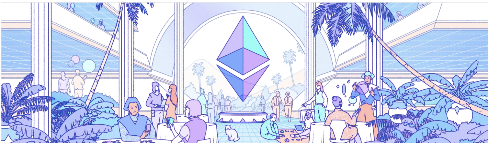

# Metamask Frontend 

This project uses HTML and Javascript to create a front end for my hardhat-fund-me contract. The UI is a simple interface with connect, get balance, fund and withdrawl buttons. 

## Built with:



Ethers,
Solidity,
JavaScript

## How to use:

```
Download/Extract or clone
cd ether-fund-me
yarn
yarn http-server
```

## Contribute:

Feel free to a fork this repo and contact me for any reason.

## Credit:

FreeCodeCamp - https://www.youtube.com/watch?v=gyMwXuJrbJQ&t=59325s

## License:

MIT © BChainDev
